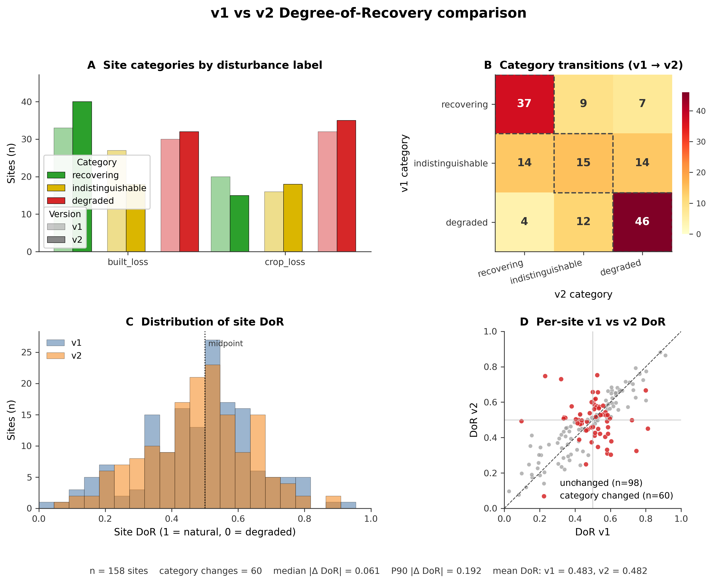
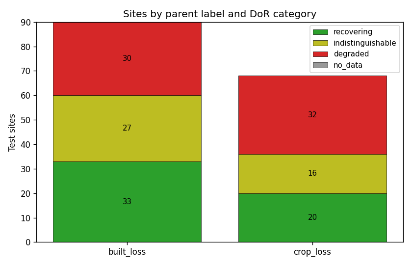
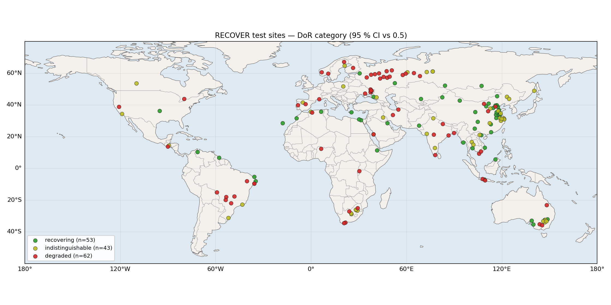
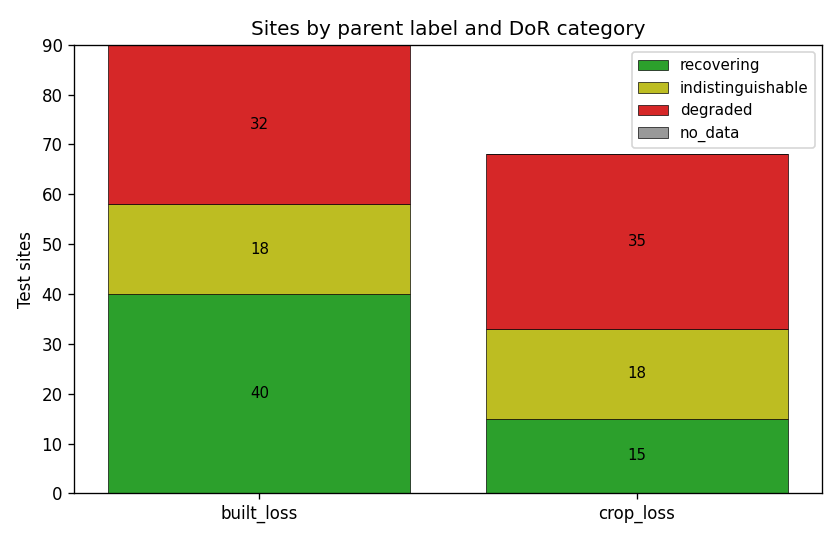
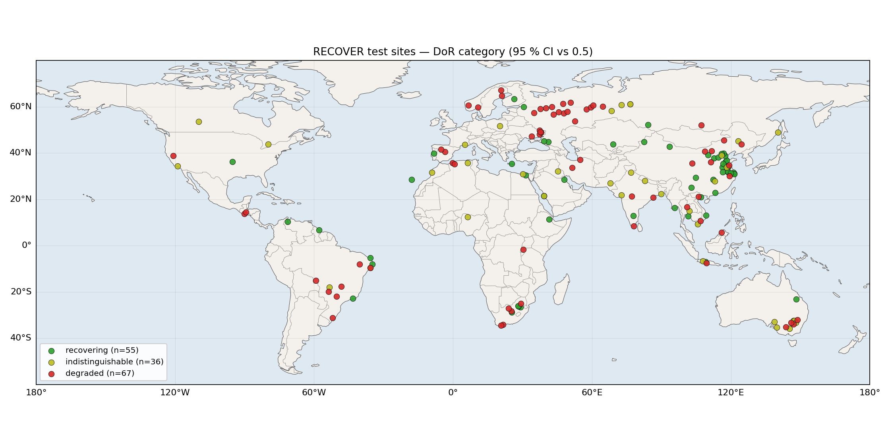
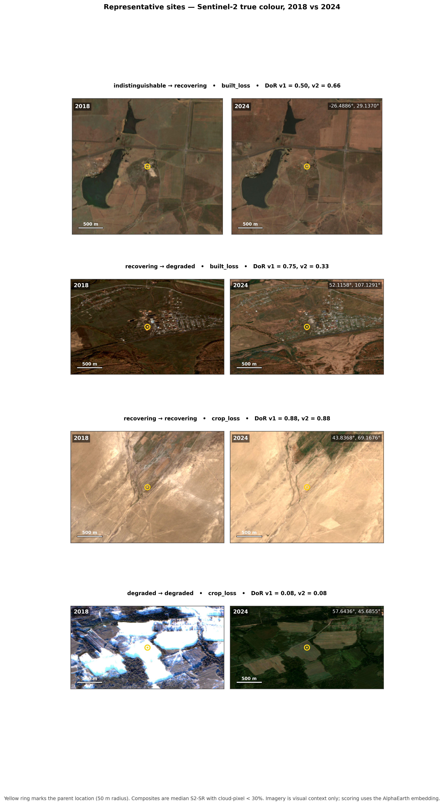

# Degree of Recovery (DoR) — Regenerated v1/v2 Report

**Audience:** ecologists with a strong working understanding of remote sensing and land-cover change.  
**Purpose:** describe the RECOVER Degree of Recovery workflow, summarize the current v1 and v2 outputs, and explain what changed between them in ecological terms.

## Summary

RECOVER scores each site by asking a simple question: does the site's 2024 AlphaEarth embedding look more like a nearby **natural reference state** or a nearby **degraded reference state**?

That comparison is done locally for each parent site using two reference clouds:

- **good references**: nearby pixels representing the natural state
- **bad references**: nearby pixels representing the degraded state linked to the site label

The score runs from 0 to 1:

- values closer to **1** mean the site looks more like the natural reference state,
- values closer to **0** mean it looks more like the degraded state,
- values near **0.5** mean it sits in the middle of the two local states.

Both v1 and v2 use that same ecological interpretation. The main difference is in how the local reference points were assembled and quality-controlled.

At the whole-dataset level, the two versions are remarkably similar in mean score:

- **v1 mean DoR:** 0.4825
- **v2 mean DoR:** 0.4823

But the similarity in the mean hides meaningful site-level changes:

- **60 of 158 sites changed category** between v1 and v2.

So the move from v1 to v2 is not a simple upward or downward shift. It is a change in how confidently individual sites are placed relative to their local natural and degraded states.

*Figure 1. Four-panel overview of the v1–v2 comparison. **A** Site counts by disturbance label and category (light bars = v1, solid = v2). **B** Site-by-site category transitions (diagonal cells, dashed, mark unchanged classifications). **C** Histogram of per-site DoR for v1 and v2. **D** Per-site v1 vs v2 DoR; sites whose category changed are highlighted in red. The important pattern is not a shift of the global mean, but a redistribution of sites among the three interpretation classes — particularly out of the indistinguishable middle.*

## How the score is constructed

For each parent site, the pipeline compares the site embedding against two local clouds of labelled reference points in AlphaEarth feature space.

The current headline score is based on the site's **typical distance** to the good cloud and its typical distance to the bad cloud. This was chosen deliberately over a simple centroid-to-centroid score because the natural reference state is often heterogeneous. Within a local neighbourhood, natural cover can include multiple vegetation expressions or structural conditions, so collapsing that cloud to one centroid can be misleading.

The score is paired with a bootstrap confidence interval. That confidence interval is central to interpretation.

Each site is assigned to one of three classes:

- **recovering**: the confidence interval sits entirely above 0.5
- **indistinguishable**: the confidence interval overlaps 0.5
- **degraded**: the confidence interval sits entirely below 0.5

That framing is useful ecologically because it distinguishes a weak hint of recovery from a result that is actually defensible.

## What changed from v1 to v2

### v1

v1 used the original parent-specific reference extraction workflow.

Its main characteristics were:

- a relatively simple local reference design,
- fixed local sampling logic,
- no explicit masking of likely recovery-related loss areas during reference selection,
- variable realized class counts in some parents, especially where the degraded class was sparse.

The strength of v1 was that it established a coherent local DoR framework and a full end-to-end workflow. The limitation was that some sites remained borderline partly because the local reference clouds were not yet as standardized or ecologically screened as they could be.

### v2

v2 kept the same scoring concept but redesigned how the references were chosen.

Its main changes were:

- **dynamic buffering**, so reference selection could expand locally rather than relying on a single fixed distance,
- **masking of likely crop-loss and built-loss regions** during candidate reference selection,
- **balanced local targets**, operationally using 100 good and 100 bad points per site,
- **strategy benchmarking** before finalizing the operational subset,
- use of the **actual site embedding** during strategy evaluation,
- addition of **effective sample size diagnostics** to flag likely redundancy caused by spatial autocorrelation.

The operational v2 product used the `random_100` strategy because it gave a strong balance of precision, stability, and simplicity.

## v1 results

### Category counts

| Label group | Recovering | Indistinguishable | Degraded | Total |
|---|---:|---:|---:|---:|
| built_loss | 33 | 27 | 30 | 90 |
| crop_loss | 20 | 16 | 32 | 68 |
| **ALL** | **53** | **43** | **62** | **158** |

### Mean DoR by label

| Label group | Mean DoR |
|---|---:|
| built_loss | 0.501 |
| crop_loss | 0.458 |
| all sites | 0.483 |

### Interpretation of v1

v1 suggests that `built_loss` sites, on average, are close to the midpoint but slightly on the recovering side, while `crop_loss` sites tend to sit a little lower on the recovery scale.

A substantial number of sites remain in the middle category. In ecological terms, that means one of two things, or both:

- the site is genuinely intermediate,
- the local reference context is still noisy or mixed enough that the method cannot confidently place it on one side of the midpoint.

That ambiguity is one of the main reasons v2 was developed.

*Figure 2. v1 category counts by disturbance type. In v1, a relatively large share of sites remain in the indistinguishable middle, especially for `built_loss`.*

*Figure 3. Global distribution of v1 site categories. This is useful mainly as a spatial screening layer rather than as evidence of any large-scale geographic trend.*

## v2 results

### Category counts

| Label group | Recovering | Indistinguishable | Degraded | Total |
|---|---:|---:|---:|---:|
| built_loss | 40 | 18 | 32 | 90 |
| crop_loss | 15 | 18 | 35 | 68 |
| **ALL** | **55** | **36** | **67** | **158** |

### Mean DoR by label

| Label group | Mean DoR |
|---|---:|
| built_loss | 0.512 |
| crop_loss | 0.443 |
| all sites | 0.482 |

### Interpretation of v2

Compared with v1, v2 produces:

- slightly more sites classed as recovering overall,
- fewer sites left in the indistinguishable middle,
- slightly more sites classed as degraded,
- a clearer difference between `built_loss` and `crop_loss` contexts.

The label-specific pattern matters:

- `built_loss` moves somewhat toward recovery in v2,
- `crop_loss` becomes slightly stricter in v2.

That is ecologically plausible. Built-loss transitions may benefit more from the cleaner removal of contaminated reference candidates, whereas crop-loss sites can remain spectrally mixed for longer and may be more sensitive to a stricter local definition of the degraded and natural states.

*Figure 4. v2 category counts by disturbance type. Compared with v1, the middle category contracts and the split between `built_loss` and `crop_loss` becomes clearer.*

*Figure 5. Global distribution of v2 site categories. The map is most useful for identifying regional clusters of sites that may merit closer ecological inspection, not for drawing causal inference on its own.*

## Direct v1-v2 comparison

### Summary metrics

| Metric | Value |
|---|---:|
| Sites compared | 158 |
| Sites changing category | 60 |
| Median absolute DoR change | 0.0606 |
| 90th percentile absolute DoR change | 0.1923 |
| Mean DoR in v1 | 0.4825 |
| Mean DoR in v2 | 0.4823 |
| Mean change in `n_eff_min` (v2 - v1) | -4.33 |

The key point is that the average score hardly changes, but many individual site interpretations do.

This means v2 is not simply re-scaling the score. It is changing the **local evidence base** used to classify sites.

### Category transitions

| v1 category | v2 category | Sites |
|---|---|---:|
| degraded | degraded | 46 |
| degraded | indistinguishable | 12 |
| degraded | recovering | 4 |
| indistinguishable | degraded | 14 |
| indistinguishable | indistinguishable | 15 |
| indistinguishable | recovering | 14 |
| recovering | degraded | 7 |
| recovering | indistinguishable | 9 |
| recovering | recovering | 37 |

### What those transitions mean

Several features stand out.

First, v2 reduces the middle category overall:

- v1: 43 indistinguishable sites
- v2: 36 indistinguishable sites

So v2 is a more decisive classification framework.

Second, the shifts go in both directions. Some sites move toward recovery, others toward degradation. That indicates the v1-v2 difference is not a simple offset. It reflects a more localized change in how the reference state is defined.

Third, the two disturbance contexts behave differently.

#### built_loss

| Version | Recovering | Indistinguishable | Degraded | Mean DoR |
|---|---:|---:|---:|---:|
| v1 | 33 | 27 | 30 | 0.501 |
| v2 | 40 | 18 | 32 | 0.512 |

For `built_loss`, v2 reduces the ambiguous middle and shifts more sites into the recovering class. This suggests that the v2 reference design is doing a better job of separating sites that have genuinely moved back toward natural structure from sites that still resemble built land.

#### crop_loss

| Version | Recovering | Indistinguishable | Degraded | Mean DoR |
|---|---:|---:|---:|---:|
| v1 | 20 | 16 | 32 | 0.458 |
| v2 | 15 | 18 | 35 | 0.443 |

For `crop_loss`, v2 is slightly stricter. Fewer sites remain in the recovering class and a few more sit on the degraded side. This is consistent with a system where cropland abandonment or recovery often remains mixed and gradual in the embedding signal.

## Example sites: 2018 vs 2024 imagery

The score tables are easier to interpret when paired with imagery of the actual landscape. The figure below shows four representative sites as **Sentinel-2 true-colour composites** for **2018** and **2024** so the visible change between the two dates can be read alongside the v1-vs-v2 score change. These composites are visual context only; they are **not** the imagery source used for scoring, and they are **not** a substitute for the embedding-based analysis.

The four examples were chosen to represent:

- a site that moved from **indistinguishable** to **recovering** (built_loss),
- a site that moved from **recovering** to **degraded** (built_loss),
- a site that stayed **recovering** in both versions (crop_loss),
- a site that stayed **degraded** in both versions (crop_loss).

*Figure 6. Representative sites in Sentinel-2 SR true-colour imagery (median composite, cloud pixel < 30%) for 2018 (left column) and 2024 (right column). The yellow ring marks the parent location (50 m radius). The 500 m scale bar applies to all panels.*

### Inspect each site interactively

Each row includes both a Google Maps pin and a Google Earth search link. The Earth links follow the format `https://earth.google.com/web/search/<lat>,<lon>/`. To see all four sites at once in Google Earth, download [v1_v2_examples.kml](plots/v1_v2_examples.kml) and open it from Google Earth ▸ File ▸ Import KML.

| # | Transition | Label | Lat, Lon | DoR v1 | DoR v2 | Maps pin | Earth search |
|---|---|---|---|---:|---:|---|---|
| 1 | indistinguishable → recovering | built_loss | -26.4886°, 29.1370° | 0.50 | 0.66 | [open pin](https://www.google.com/maps?q=-26.488580,29.137015) | [open earth](https://earth.google.com/web/search/-26.488580,29.137015/) |
| 2 | recovering → degraded | built_loss | 52.1158°, 107.1291° | 0.75 | 0.33 | [open pin](https://www.google.com/maps?q=52.115757,107.129126) | [open earth](https://earth.google.com/web/search/52.115757,107.129126/) |
| 3 | recovering → recovering | crop_loss | 43.8368°, 69.1676° | 0.88 | 0.88 | [open pin](https://www.google.com/maps?q=43.836767,69.167606) | [open earth](https://earth.google.com/web/search/43.836767,69.167606/) |
| 4 | degraded → degraded | crop_loss | 57.6436°, 45.6855° | 0.08 | 0.08 | [open pin](https://www.google.com/maps?q=57.643584,45.685494) | [open earth](https://earth.google.com/web/search/57.643584,45.685494/) |

Taken together, these examples reinforce the main interpretation of the v1-v2 comparison: the revised method is not simply moving all sites in one direction. It changes how the local comparison is framed, which matters most in mixed or transitional landscapes.

## What to use operationally

The current recommendation is:

- use **v2** as the preferred operational product,
- retain **v1** as the baseline sensitivity comparison,
- examine sites that changed category between versions as priority review cases,
- interpret `built_loss` and `crop_loss` separately,
- use the v2 `n_eff` fields as contextual diagnostics, not as hard exclusion rules.

The most robust sites are likely to be:

- recovering in both versions,
- degraded in both versions,
- or shifted out of the indistinguishable middle under v2 in a way that matches local imagery.

The least stable sites are those that flip directly between recovering and degraded. Those deserve direct inspection in imagery because they are likely sensitive to local land-cover complexity, mixed pixels, or the exact composition of the reference cloud.

## Caveats

- This is still a **single-year** product for 2024. Recovery is a process, so the natural next step is a multi-year trajectory.
- The v2 effective sample size values are currently conservative because many fitted correlation ranges are long. These diagnostics are still useful, but they likely need regularization before being used as operational thresholds.
- `crop_loss` and `built_loss` should not be treated as the same ecological process.
- Some sites will remain difficult because the landscape itself is heterogeneous, not because the method is failing.

## Current outputs

v1:

- [degreeRecover/data/test_site_dor_v1.csv](../data/test_site_dor_v1.csv)
- [degreeRecover/data/test_site_dor_v1.shp](../data/test_site_dor_v1.shp)
- [degreeRecover/data/dor_summary_by_label_v1.csv](../data/dor_summary_by_label_v1.csv)

v2:

- [v2/data/test_site_dor_v2.csv](../../v2/data/test_site_dor_v2.csv)
- [v2/data/test_site_dor_v2.shp](../../v2/data/test_site_dor_v2.shp)
- [v2/data/dor_summary_by_label_v2.csv](../../v2/data/dor_summary_by_label_v2.csv)

comparison:

- [v2/data/v1_vs_v2/v1_vs_v2_summary.csv](../../v2/data/v1_vs_v2/v1_vs_v2_summary.csv)
- [v2/data/v1_vs_v2/v1_vs_v2_site_scores.csv](../../v2/data/v1_vs_v2/v1_vs_v2_site_scores.csv)
- [v2/data/v1_vs_v2/v1_vs_v2_category_transition.csv](../../v2/data/v1_vs_v2/v1_vs_v2_category_transition.csv)

For the end-to-end workflow, see [degreeRecover/report/PIPELINE.md](PIPELINE.md).
