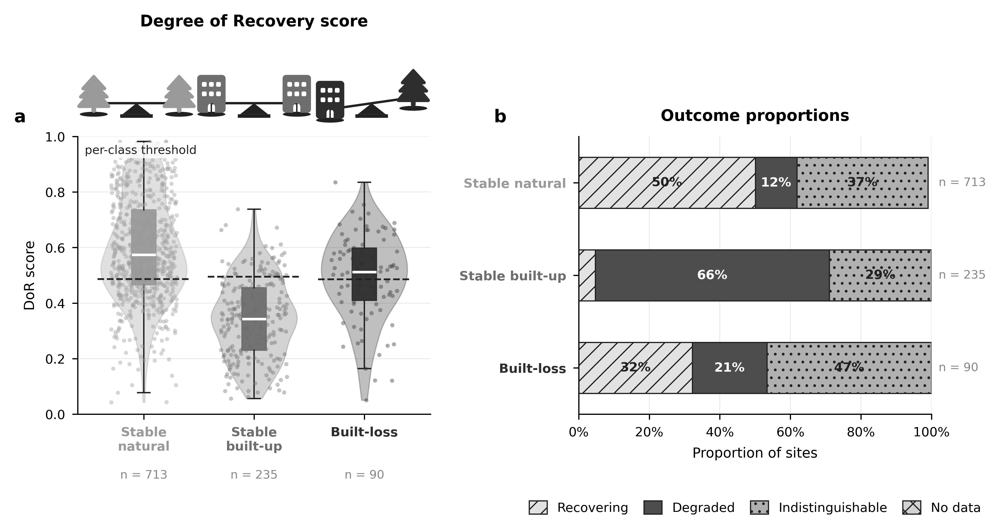
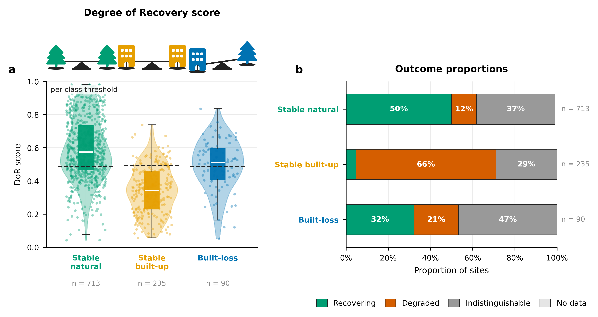
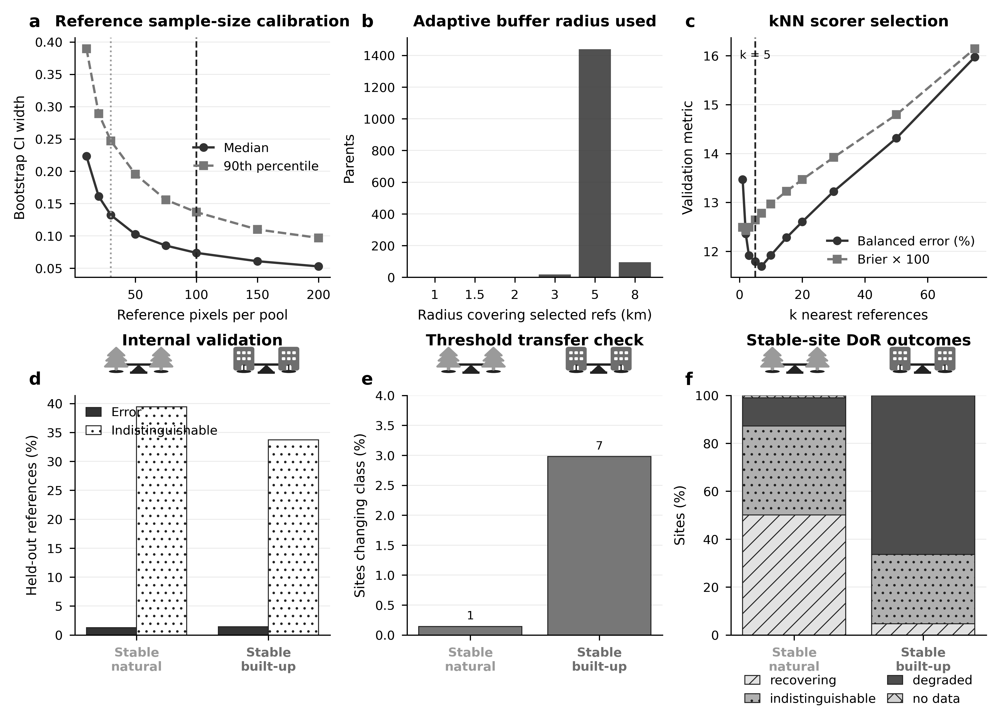
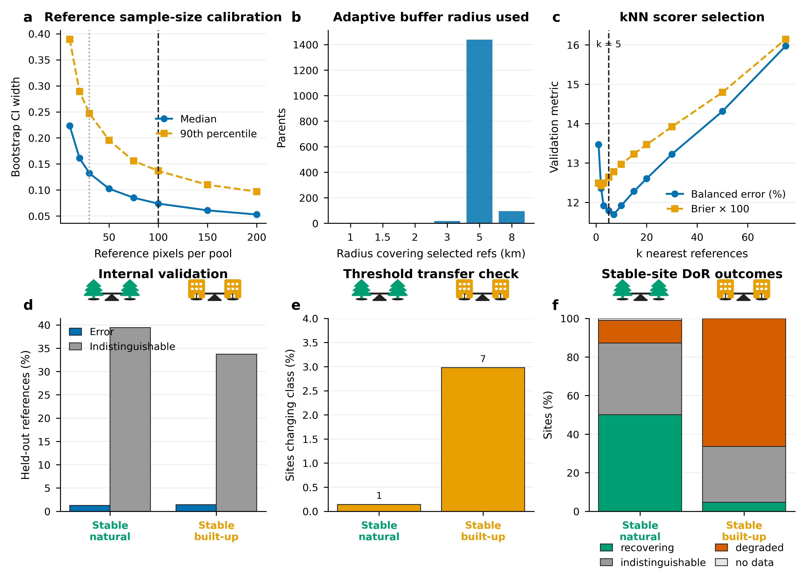

# Assessing the degree of recovery

## Main Methods Text (~800 words)

We estimated nature regeneration at abandonment sites with a local space-for-time comparison: does the site now look more like nearby near-natural land, or more like the built-up land it replaced? This Degree of Recovery (DoR) analysis was applied after candidate abandonment had already been mapped, sampled, and then labelled by experts as 'built-loss' or 'stable'. The DoR assessment does not identify abandonment by itself.

The analysis used two sets of class labels from the upstream abandonment workflow. The abandonment class was 'built-loss', for abandonment of built-up land and infrastructure. A second upstream label, 'stable', marked sites with no detected transition during 2018-2024. Because stable sites could belong to stable near-natural or stable built-up classes, we assigned them to one of these two classes using agreement among independent land-cover and building-footprint products (Supplementary Table S1). Stable built-up sites were processed as control sites with the same workflow as built-loss, but they were not interpreted as recovery observations. Of 1,608 stable sites, 1,471 had sufficient valid reference data and non-conflicting stable-site classes. Stable built-up sites served as controls because they should remain closer to their own non-natural state than to near-natural vegetation.

For each of the 90 built-loss test sites and 1,471 scored stable-site controls, we used the 2024 AlphaEarth annual satellite embedding (Brown et al., 2025), a 64-band representation of the land surface at 10 m resolution. This embedding captures climatic, topographical, spectral, phenological, and structural characteristics more fully than standard single indices. Around each test site we sampled two local reference pools in Google Earth Engine. The near-natural pool consisted of ESA WorldCover pixels that were not cropland, built-up land, water, or pixels with evidence of recent loss based on the loss masks from the upstream analysis. The non-natural pool was selected to match each test site's 2018 land cover: built-up pixels for built-loss and stable built-up test sites, and built-up pixels for stable near-natural test sites.

Reference pixels were sampled from adaptive 1-8 km concentric buffers around the test site. The sampler started locally and expanded through 1, 1.5, 2, 3, 5, and 8 km radii until sufficient valid near-natural and non-natural pixels were available, defined as at least 30 pixels per pool with a target of 100 per pool (Supplementary Figure S1). This kept references as local as possible while still allowing sites in sparse or homogeneous landscapes to be scored. These values were selected based on sampling experiments (Figure S1): 100 pixels per pool gave stable DoR scores and near-plateau confidence-interval widths, and 30 pixels per pool was used as a minimum point-count floor. This was a point-count rule rather than an autocorrelation-adjusted effective-sample-size threshold.

DoR was computed in satellite-embedding space, not in physical distance. Cosine distance compares the pattern of values across the 64 AlphaEarth bands while down-weighting differences in overall vector size. The score therefore compares whole land-surface signatures rather than a single greenness or brightness index. For each site, we calculated cosine distances from the test site's embedding to all pixels in its local near-natural and non-natural reference pools. The score used the mean distance to the five nearest pixels in each pool. Ecologically, this means that each site was compared with its closest local analogues, such as the most similar nearby near-natural vegetation and the most similar nearby cropland or built-up land, rather than with the average of a mixed landscape pool. If \(d_{nat}\) is the mean embedding distance to the five nearest near-natural references, and \(d_{non}\) is the mean embedding distance to the five nearest non-natural references (eqn. 1), then

\(DoR = d_{non} / (d_{nat} + d_{non})\)  (1).

Values closer to 1 indicate that the site is more similar to the five local near-natural reference pool, while values closer to 0 indicate that it remains more similar to the non-natural reference state. A value of 0.5 is only the descriptive midpoint of the distance ratio; it was not assumed to be the classification threshold to separate recovering from degrading sites.

Class-specific thresholds were determined empirically from the reference pool data. Known near-natural and non-natural reference pixels from the sampled reference pools were held out, scored against the remaining local references, and used to fit thresholds that best separated the near-natural and non-natural reference classes using Youden's J statistic (Youden, 1950). These thresholds were then evaluated with within-parent validation, meaning that each held-out reference pixel was tested only against the other reference pixels sampled around the same parent site. The validation asked whether held-out known-good near-natural references were classified as recovering and held-out known-bad non-natural references as degraded. The same validation guided design choices about k-nearest-neighbour scoring, reference sample sizes, threshold placement, confidence intervals, and sensitivity rules (Figure S1). This is an internal validation of the reference-state comparison, not an independent field validation of ecological recovery.

For each site, DoR uncertainty was estimated with 2,000 bootstrap resamples of the local reference pools. A site was classified as recovering when its 95% bootstrap confidence interval lay entirely above the empirically fitted threshold, degraded when it lay entirely below, indistinguishable when it overlapped the threshold, and no data when the site embedding was missing or either reference pool had fewer than five valid embedding vectors for the k-nearest-neighbour comparison. In this context, indistinguishable is an intentional no-decision category: the satellite embedding did not provide enough evidence to confidently separate the site from the threshold. DoR score distributions and outcome proportions for abandonment sites and stable-site controls are summarised in Figure 1.

**Figure 1. Degree of Recovery outcomes for abandonment sites and stable-site controls.** **a,** Distribution of DoR scores for the stable-natural and stable-built-up controls and the 90 built-loss abandonment test sites. Violins show the score distribution; box plots show the interquartile range and median; points show individual site scores (jittered). Dashed lines mark the empirically fitted per-class classification thresholds. **b,** Proportions of sites in each class classified as recovering, degraded, indistinguishable, or no data. Low recovering rates among stable built-up (5%) control sites confirm that the method is not systematically misclassifying persistent non-natural land as recovering. Greyscale and colour versions are shown; one will be selected for publication.

---

## Main Methods Text — 522-word version

We estimated nature regeneration at 90 built-loss abandonment sites with a local space-for-time comparison, asking whether each site more closely resembles nearby near-natural land or the built-up land it replaced. The Degree of Recovery (DoR) score is applied after abandonment has been identified; it does not detect abandonment. Stable built-up control sites were processed identically but not interpreted as recovery observations.

'Stable' sites carried no loss-defined class by experts, so we classified them as stable near-natural, stable built-up, or ambiguous by a majority vote across six independent land-cover and building-footprint products (Supplementary Table S1). Of 1,608 stable sites, 56 were ambiguous and excluded from scoring; 1,471 had sufficient valid reference data and were scored as controls. Stable built-up controls are expected to score as non-natural; high recovery rates in these classes would indicate false positives.

For each test site we used the 2024 AlphaEarth annual satellite embedding (Brown et al., 2025), a 64-band, 10 m representation of the land surface capturing spectral, phenological, structural, climatic, and topographical characteristics. Two local reference pools were sampled in Google Earth Engine around each site. The near-natural pool comprised ESA WorldCover pixels that were not cropland, built-up land, or water, excluding pixels with evidence of recent loss based on the loss masks from the upstream analysis. The non-natural pool matched the site's 2018 land cover: built-up pixels for built-loss and stable built-up sites, and built-up pixels for stable near-natural sites.

Reference pixels were drawn from adaptive 1-8 km concentric buffers, expanding through radii of 1, 1.5, 2, 3, 5, and 8 km until at least 30 pixels per pool were obtained, with a target of 100 (Figure S1). These parameters were chosen from sampling experiments: scores and confidence-interval widths stabilised near 100 pixels per pool, and 30 pixels was the minimum point-count floor rather than an autocorrelation-adjusted effective sample size.

DoR was computed using cosine distance in embedding space, comparing the pattern of values across the 64 AlphaEarth bands while down-weighting differences in overall vector size. For each site, we took the mean cosine distance to the five nearest pixels in each pool, so the comparison used the closest local near-natural and non-natural analogues rather than the average of a mixed reference pool. If \(d_{nat}\) and \(d_{non}\) are the mean distances to the five nearest near-natural and non-natural references (eqn. 1), then

\(DoR = d_{non} / (d_{nat} + d_{non})\)  (1).

Values near 1 indicate near-natural similarity; values near 0 indicate non-natural similarity. The classification threshold was not assumed to be 0.5 but was fitted empirically using Youden's J statistic (Youden, 1950), separately for each stable class (thresholds: 0.4861 for stable near-natural, 0.4948 for stable built-up). Uncertainty was estimated with 2,000 bootstrap resamples of the reference pools. A site was classified as recovering when its 95% confidence interval lay entirely above the threshold, degraded when entirely below, indistinguishable when overlapping the threshold, and no data when the site embedding or reference comparison could not support the five-nearest-neighbour score. DoR score distributions and outcome proportions are shown in Figure 1.

---

## Main Methods Text — 280-word version

We quantified nature regeneration at 90 built-loss candidate abandonment sites using a local space-for-time Degree of Recovery (DoR) score that asks whether each site more closely resembles nearby near-natural land or the built-up land it replaced; 1,471 stable-site controls were scored identically. Stable sites had no loss-defined class by experts, so we assigned each to stable near-natural, stable built-up, or ambiguous using a majority vote across six independent land-cover and building-footprint datasets (Table S1); 56 ambiguous sites were excluded from scoring.

For each site we computed cosine distances in the 64-band, 10 m AlphaEarth embedding space (Brown et al., 2025), a compact representation of spectral, phenological, structural, climatic, and topographical characteristics, between the test site and two local reference pools sampled from adaptive 1-8 km concentric buffers (target 100 pixels per pool, minimum point-count floor of 30; Figure S1). The near-natural pool used ESA WorldCover pixels that were not cropland, built-up land, water, or flagged by the loss masks from the upstream analysis; the non-natural pool matched the site's 2018 land cover. Using the mean cosine distance to the five nearest local analogue pixels in each pool, \(d_{nat}\) and \(d_{non}\) (eqn. 1),

\(DoR = d_{non} / (d_{nat} + d_{non})\)  (1),

where values near 1 indicate near-natural similarity and values near 0 indicate non-natural similarity. Classification thresholds were fitted empirically by Youden's J statistic (Youden, 1950), separately for each stable class. Sites were classified as recovering, degraded, or indistinguishable based on whether their 95% bootstrap confidence interval (2,000 resamples) lay entirely above, entirely below, or overlapping the threshold (Figure 1); no data was assigned when the site embedding or reference comparison could not support the five-nearest-neighbour score.

---

## Results (augment)

The abandonment test sites comprised 90 built-loss sites. Among these, 29 (32.2%) were classified as recovering, 19 (21.1%) as degraded, and 42 (46.7%) as indistinguishable (Figure 1a, c).

For the stable-site evaluation, 1,608 stable sites were considered. The multi-source stable-class vote assigned 788 as stable near-natural, 236 as stable built-up, and 56 as ambiguous. After excluding ambiguous sites and sites without sufficient valid reference data, 1,471 sites had final DoR categories: 412 (28.0%) were classified as recovering, 525 (35.7%) as degraded, 527 (35.8%) as indistinguishable, and 7 (0.5%) as no data (Figure 1b, d). The results for the control sites are consistent with the intended interpretation: only 4.7% of stable built-up controls were classified as recovering, indicating that the method does not systematically misclassify persistent non-natural land.

## Supplementary Methods Text

### Analysis Classes

The upstream abandonment analysis supplied two broad site types. One was the candidate abandonment class: 'built-loss', representing candidate loss of built-up land or infrastructure. For this class, the non-natural reference state was built-up land.

The second type was 'stable', meaning that no land-cover transition was detected over 2018-2024. These sites were included as controls for calibration and validation, but first required a land-cover class. We classified them as stable natural, stable built-up, or ambiguous using a majority vote across six independent land-cover and building-footprint products (Table S1). Of 1,608 stable sites, 56 were labelled ambiguous and excluded from scoring; 1,471 had sufficient valid reference data and were scored. Stable built-up sites are expected to remain close to their own non-natural reference pools. If many such controls were classified as recovering, that would indicate a false-recovery problem in the method.

### Stable-Site Classification

Stable sites were classified by majority vote from up to six independent sources: ESA WorldCover 2020, ESA WorldCover 2021, Dynamic World, ESA WorldCereal temporary crops, VIDA building footprints, and Microsoft building footprints. Raster products were sampled at the site location. Building products were evaluated with a 30 m proximity test after assigning each site to a country with geoBoundaries (Runfola et al., 2020). Each source voted for near-natural, built-up, or unknown. The final stable class was assigned when at least two non-unknown sources agreed on the modal class; otherwise the site was labelled ambiguous and excluded.

**Table S1. Land-cover and building-footprint datasets used for stable-site classification.**

| Dataset | Spatial resolution | Temporal coverage | Classes used | GEE asset / source |
|---|---|---|---|---|
| ESA WorldCover v100 (Zanaga et al., 2021) | 10 m | 2020 | Built-up (50), other = natural | `ESA/WorldCover/v100` |
| ESA WorldCover v200 (Zanaga et al., 2022) | 10 m | 2021 | Built-up (50), other = natural | `ESA/WorldCover/v200` |
| Dynamic World V1 (Brown et al., 2022) | 10 m | 2024 annual mode | Built (6), other = natural | `GOOGLE/DYNAMICWORLD/V1` |
| VIDA Combined Building Footprints (VIDA, 2024) | N/A (Vector) | — | Built-up if any footprint within 30 m of site | `projects/sat-io/open-datasets/VIDA_COMBINED/<ISO3>` |
| Microsoft Global Building Footprints (Microsoft, 2024) | N/A (Vector) | — | Built-up if any footprint within 30 m of site | `projects/sat-io/open-datasets/MSBuildings/<country_name>` |

### Reference Pools

Each site was compared only with references from its own local landscape. This local design reduces the influence of spatially invariant biases — systematic effects shared by the test site and nearby reference pixels, including regional phenology, soil and background reflectance, atmospheric residuals, illumination, and sensor-viewing effects. Because the test site and its references are affected in similar ways, the relative comparison is less sensitive to those shared effects. This does not remove spatially varying errors within the buffer, nor does it correct map-label errors in the reference products.

The near-natural pool was defined as WorldCover pixels that were not cropland, built-up land, water, or pixels with evidence of recent loss based on the loss masks from the upstream analysis. The non-natural pool depended on the site class: built-up land for built-loss or stable built-up sites, and built-up land for stable near-natural sites.

### Buffer and Sample-Size Rationale

References were selected from adaptive buffers of 1, 1.5, 2, 3, 5, and 8 km. The purpose was to keep references local. A 1 km radius preserves strong local comparability when enough near-natural and non-natural pixels are present. The larger radii provide fallbacks for sparse natural cover, sparse built-up pixels, or homogeneous agricultural landscapes. The 8 km cap limits the risk of drawing references from a different landscape context.

The sampler used a target of 100 near-natural and 100 non-natural pixels per site. This target came from earlier sampling experiments showing that confidence-interval width and score stability improved rapidly up to about 100 pixels per class and then showed little additional gain. A minimum of 30 pixels per class was used as a practical point-count floor below which the local reference comparison becomes too poorly supported; this floor was not an autocorrelation-adjusted effective sample size.

The distances used in the DoR score are distances in the 64-dimensional AlphaEarth embedding space, not distances on the ground. Ground distance is used only to choose nearby reference pixels within the buffers; DoR itself uses cosine distance between satellite-embedding vectors. Cosine distance compares the pattern of values across the 64 bands while down-weighting differences in overall vector size, so the score compares whole land-surface signatures rather than a single spectral index.

For each site, the method calculated the mean cosine distance to the five nearest near-natural references and the five nearest non-natural references. The five-nearest-neighbour score was selected because local reference pools are heterogeneous: a near-natural pool may include trees, shrubs, grassland, wetlands, or bare natural cover depending on the biome. Using the nearest few analogues lets the site be compared with the most relevant examples rather than with the average of a mixed pool.

Because AlphaEarth embeddings also encode climatic and topographical context, we checked whether the five nearest embedding neighbours were simply the closest reference pixels on the ground. Across the actual reference pools, the median within-pool correlation between cosine distance and ground distance was weak (r = 0.153 across candidate and stable sites). The five selected neighbours were somewhat more local than the remaining references (median 1.94 km versus 2.48 km), but they were not just the spatially nearest pixels. This diagnostic reduces, but does not eliminate, the possibility that broad environmental gradients influence analogue selection; the local-buffer design is intended to keep those gradients similar between each test site and its references. The score is

\(DoR = d_{non} / (d_{nat} + d_{non})\),

where \(d_{nat}\) is the mean embedding distance to the five nearest near-natural references and \(d_{non}\) is the mean embedding distance to the five nearest non-natural references. High values indicate the site is closer to the near-natural references; low values indicate it is closer to the non-natural references.

### Thresholds, Confidence, and Internal Validation

Thresholds were not chosen by assuming that 0.5 is the correct cut-off. Instead, they were fitted empirically from the reference data. Each reference pixel has a known reference label by construction: near-natural or non-natural. During calibration, reference pixels were held out, scored against the remaining references from the same parent site, and compared with their known labels. Candidate thresholds were swept across the resulting score distribution, and the selected threshold maximised Youden's J statistic, which balances correct identification of the two reference states.

This calibration was performed separately for the stable natural and stable built-up classes, because the embedding contrast between near-natural vegetation and built-up land can vary. The fitted k-nearest-neighbour thresholds were 0.4861 for stable near-natural sites and 0.4948 for stable built-up sites. Applying the earlier pooled threshold changed only 13 of 1,471 stable-site categories (0.9%), indicating that the per-class thresholds were close to the pooled operating point.

The same held-out-reference framework served as internal validation. It tested whether known natural references were classified as recovering and known non-natural references as degraded when scored against the remaining local references from the same parent site. At the final operating point, internal reference-label error rates among non-abstained reference pixels were 0.6-2.2% across stable classes and reference states. Abstention rates of 33-45% reflect how often the method correctly declined to make a confident call when the two local reference states were not clearly separated.

### Categorical Outcomes

The reported classification uses the bootstrap confidence interval around each site-level DoR score. A site is classified as recovering if the full 95% confidence interval is above the fitted threshold, degraded if the full interval is below the threshold, and indistinguishable if the interval overlaps the threshold. This conservative rule avoids over-interpreting scores close to the decision boundary.

### Stable-Site Summary Statistics

The stable-site analysis considered 1,608 stable sites. Of these, 56 were labelled ambiguous after multi-source classification and excluded. After reference sampling and scoring, 1,471 sites had final DoR categories (Table S2).

**Table S2. Final stable-site Degree of Recovery (DoR) outcomes by stable class (Figure S1f).**

| Stable class | n | Recovering | Degraded | Indistinguishable | No data |
|---|---:|---:|---:|---:|---:|
| Stable natural | 713 | 357 (50.1%) | 84 (11.8%) | 265 (37.2%) | 7 (1.0%) |
| Stable built-up control | 235 | 11 (4.7%) | 156 (66.4%) | 68 (28.9%) | 0 (0.0%) |
| **Total** | **948** | **368 (38.8%)** | **240 (25.3%)** | **333 (35.1%)** | **7 (0.7%)** |

Most stable built-up (95.3%) sites were classified as degraded or indistinguishable, confirming that the method is not systematically misclassifying persistent non-natural land as recovering. For stable natural sites, the label recovering means "natural-like in the DoR comparison" and should not be read as evidence of a detected land-cover transition.

**Supplementary Figure S1. Diagnostics supporting Degree of Recovery design choices.**  
**a,** Reference sample-size calibration showing how bootstrap confidence-interval width declines as the number of reference pixels per pool increases. Vertical lines mark the 30-pixel minimum and 100-pixel target used in the final sampler. **b,** Distribution of the adaptive buffer radius required to obtain sufficient local reference pixels. **c,** k-nearest-neighbour scorer selection, showing internal validation metrics across k and the selected value \(k = 5\). **d,** Internal reference-label validation for the final kNN operating point (k=5), summarising error and indistinguishable rates for held-out reference pixels. **e,** Threshold-transfer check, showing the percentage of sites whose category changed when applying the pooled threshold instead of the class-specific thresholds; numbers above bars show changed-site counts. **f,** Final stable-site DoR outcomes by stable class.

## Notes For Other Sections

- Present DoR as a local reference-state estimate of recovery in satellite-embedding space, complementary to visual interpretation rather than a replacement for field validation.
- In the Discussion, state that DoR measures spectral and structural similarity to local near-natural references. It does not directly measure species composition, biodiversity, ecosystem function, or carbon.

## Citations

- Brown, C.F., Brumby, S.P., Guzder-Williams, B., Birch, T., Hyde, S.B., Mazzariello, J., Czerwinski, W., Pasquarella, V.J., Haertel, R., Ilyushchenko, S. and Schwehr, K., 2022. Dynamic World, Near real-time global 10 m land use land cover mapping. *Scientific data*, 9(1), p.251.
- Brown, C.F., Kazmierski, M.R., Pasquarella, V.J., Rucklidge, W.J., Samsikova, M., Zhang, C., Shelhamer, E., Lahera, E., Wiles, O., Ilyushchenko, S. and Gorelick, N., 2025. Alphaearth foundations: An embedding field model for accurate and efficient global mapping from sparse label data. *arXiv preprint* arXiv:2507.22291.
- Microsoft. Microsoft/GlobalMLBuildingFootprints. https://www.github.com/microsoft/GlobalMLBuildingFootprints/ (2024). Date Accessed: 2026-05-14
- Runfola, D., Anderson, A., Baier, H., Crittenden, M., Dowker, E., Fuhrig, S., Goodman, S., Grimsley, G., Layko, R., Melville, G. and Mulder, M., 2020. geoBoundaries: A global database of political administrative boundaries. *PloS one*, 15(4), p.e0231866.
- Google-Microsoft Open Buildings - combined by VIDA, https://beta.source.coop/repositories/vida/google-microsoft-open-buildings. Date Accessed: 2026-05-14
- Youden, W.J., 1950. Index for rating diagnostic tests. *Cancer*, 3(1), pp.32-35.
- Zanaga, D., Van De Kerchove, R., De Keersmaecker, W., Souverijns, N., Brockmann, C., Quast, R., Wevers, J., Grosu, A., Paccini, A., Vergnaud, S., Cartus, O., Santoro, M., Fritz, S., Georgieva, I., Lesiv, M., Carter, S., Herold, M., Li, Linlin, Tsendbazar, N.E., Ramoino, F., Arino, O., 2021. ESA WorldCover 10 m 2020 v100. (doi:10.5281/zenodo.5571936)
- Zanaga, D., Van De Kerchove, R., De Keersmaecker, W., Souverijns, N., Brockmann, C., Quast, R., Wevers, J., Grosu, A., Paccini, A., Vergnaud, S., Cartus, O., Santoro, M., Fritz, S., Georgieva, I., Lesiv, M., Carter, S., Herold, M., Li, Linlin, Tsendbazar, N.E., Ramoino, F., Arino, O., 2021. ESA WorldCover 10 m 2020 v100. (doi:10.5281/zenodo.5571936)
