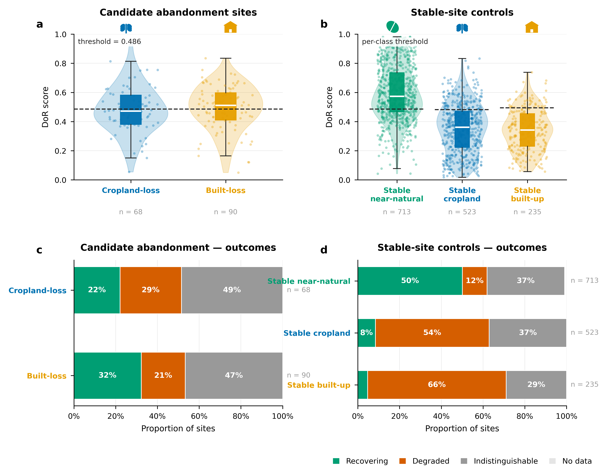
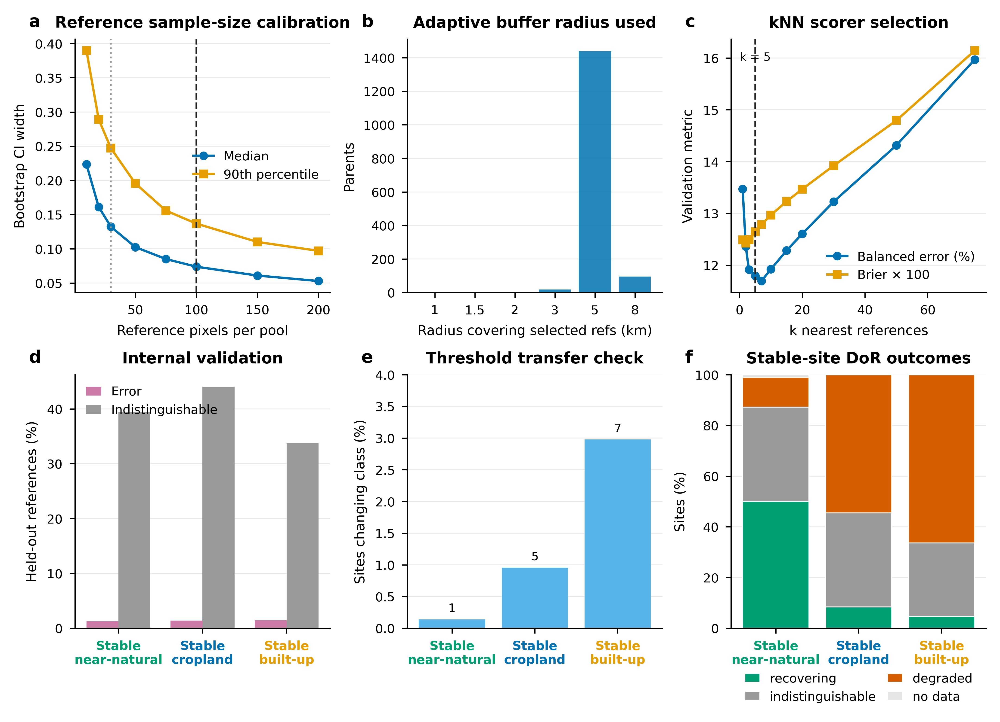

# Assessing the degree of recovery

## Main Methods Text — Full version (~850 words)

We estimated nature regeneration at sampled candidate abandonment sites by asking a local comparison question: does the site now look more like nearby near-natural land, or more like the transformed cropland or built-up land? This Degree of Recovery (DoR) analysis was applied after candidate abandonment had already been mapped, sampled, and labelled by experts as 'built-loss', 'crop-loss' and 'stable'. The DoR assessment does not identify abandonment by itself. Stable cropland and stable built-up sites were processed as controls with the same workflow as built-loss and crop-loss, but they were not interpreted as recovery observations.

The analysis used two sets of class labels from the upstream abandonment workflow. The abandonment classes were 'crop-loss', for abandonment of cropland, and 'built-loss', for abandonment of built-up land and infrastructure. A third upstream label, 'stable', marked sites with no detected transition during 2018-2024. Because stable sites could belong to either the stable cropland, buildings or the nature class, we assigned them to stable near-natural, stable cropland, stable built-up, or ambiguous classes using agreement among independent land-cover and building-footprint products (Supplementary Table S1). Of 1,608 stable sites, 56 were ambiguous and excluded; the remaining 1,471 were scored as controls. Stable cropland and stable built-up sites served as controls because they should remain closer to their own non-natural state than to near-natural vegetation.

For each of the 158 test sites (68 cropland-loss, 90 built-loss) and 1,471 scored stable-site controls, we used the 2024 AlphaEarth annual satellite embedding (Brown et al., 2025), a 64-band representation of the land surface at 10 m resolution. This embedding captures complex climatic, topographical, spectral, phenological, and structural characteristics more comprehensively than standard single indices. Around each test site we sampled two local reference pools in Google Earth Engine. The near-natural pool consisted of ESA WorldCover pixels that were not cropland, built-up land, or water, after excluding pixels with evidence of recent loss based on the loss masks from the upstream analysis. The non-natural pool was selected to match each test site's 2018 land cover: cropland pixels for cropland-loss and stable cropland test sites, built-up pixels for built-loss and stable built-up test sites, and the union of cropland and built-up pixels for stable near-natural test sites. <!-- TODO(reviewer): please confirm the non-natural pool routing for stable near-natural sites is the union of cropland and built-up (not one or the other), and that nature-stable / natural-stable sites are not also routed into the cropland and built-up branches separately. -->

Reference pixels were sampled from adaptive 1-8 km concentric buffers around the test site. The sampler started locally and expanded through 1, 1.5, 2, 3, 5, and 8 km radii until sufficient valid near-natural and non-natural pixels were available, defined as at least 30 pixels per pool with a target of 100 per pool (Supplementary Figure S1). This kept references as local as possible while still allowing sites in sparse or homogeneous landscapes to be scored. The target was 100 pixels per reference pool, with a minimum of 30 pixels per pool and a maximum of 200 total reference pixels per site. These values were selected based on sampling experiments: 100 pixels per pool gave stable DoR scores and near-plateau confidence-interval widths, and 30 pixels per pool was used as a minimum effective sample-size floor. <!-- TODO(reviewer): the 30-pixel floor is a hard-coded minimum on raw point counts in the v4 production sampler, not derived from an autocorrelation-adjusted effective sample size. Happy to change the wording to "minimum point-count floor" if you prefer. -->

DoR was computed in satellite-embedding space, not in physical distance. Cosine distance was used because the AlphaEarth embedding encodes information primarily in the angular orientation of its 64-band vectors rather than in their magnitudes, so cosine similarity (and its complement, cosine distance) is the natural metric for comparing embedding vectors. For each site, we calculated cosine distances from the site's 64-band embedding to all pixels in its local near-natural and non-natural reference pools. We then used the mean distance to the five nearest (based on cosine distance) pixels in each pool. If \(d_{nat}\) is the mean embedding distance to the five nearest near-natural references, and \(d_{non}\) is the mean embedding distance to the five nearest non-natural references, then

\(DoR = d_{non} / (d_{nat} + d_{non})\).

Values closer to 1 indicate that the site is more similar to the local near-natural reference pool, while values closer to 0 indicate that it remains more similar to the non-natural reference state. A value of 0.5 is only the descriptive midpoint of the distance ratio; it was not assumed to be the classification threshold.

Class-specific thresholds were determined empirically from the reference pool data. Known near-natural and non-natural reference pixels were held out, scored against the remaining local references, and used to fit thresholds that best separated the two reference classes using Youden's J statistic (Youden, 1950). These thresholds were then evaluated with within-parent validation, asking whether held-out known-good references were classified as recovering and held-out known-bad references as degraded. The same validation guided design choices about k-nearest-neighbour scoring, reference sample sizes, threshold placement, confidence intervals, and sensitivity rules. This is an internal validation of the reference-state comparison, not an independent field validation of ecological recovery.

For each site, uncertainty was estimated with 2,000 bootstrap resamples of the local reference pools. A site was classified as recovering when its 95% bootstrap confidence interval lay entirely above the empirically fitted threshold, degraded when it lay entirely below, indistinguishable when it overlapped the threshold, and no data when the embedding or reference comparison was invalid. In this context, indistinguishable is an intentional no-decision category: the satellite embedding did not provide enough evidence to confidently separate the site from the threshold. DoR score distributions and outcome proportions for candidate abandonment sites and stable-site controls are summarised in Figure 1.

**Figure 1. Degree of Recovery outcomes for candidate abandonment sites and stable-site controls.** **a,** Distribution of DoR scores for the 158 candidate abandonment test sites (68 cropland-loss, 90 built-loss). Box plots show the interquartile range and median; points show individual site scores (jittered). The dashed line marks the empirically fitted classification threshold (0.4859). **b,** DoR score distributions for the 1,471 scored stable-site controls, stratified by stable class. **c,** Proportions of candidate abandonment sites classified as recovering (teal), degraded (terracotta), or indistinguishable (grey). **d,** Proportions of stable-site controls by outcome. Low recovering rates among stable cropland (8%) and stable built-up (5%) controls confirm that the method is not systematically misclassifying persistent non-natural land as recovering.

---

## Main Methods Text — 500-word version

We estimated nature regeneration at 158 candidate abandonment sites (68 cropland-loss, 90 built-loss) by asking whether each site more closely resembles nearby near-natural land or the transformed land it replaced. The Degree of Recovery (DoR) score is applied after abandonment has been identified; it does not detect abandonment. Stable cropland and stable built-up sites (n = 1,471 scored controls) were processed identically but not interpreted as recovery observations.

'Stable' sites carried no loss-defined class by experts, so we classified them as stable near-natural, stable cropland, stable built-up, or ambiguous by a majority vote across six independent land-cover and building-footprint products (Supplementary Table S1). Of 1,608 stable sites, 56 were ambiguous and excluded. Stable cropland and stable built-up controls are expected to score as non-natural; high recovery rates in these classes would indicate false positives.

For each test site we used the 2024 AlphaEarth annual satellite embedding (Brown et al., 2025), a 64-band, 10 m representation of the land surface capturing spectral, phenological, structural, climatic, and topographical characteristics. Two local reference pools were sampled in Google Earth Engine around each site. The near-natural pool comprised ESA WorldCover pixels that were not cropland, built-up land, or water, excluding pixels with evidence of recent loss based on the loss masks from the upstream analysis. The non-natural pool matched the site's 2018 land cover: cropland pixels for cropland-loss and stable cropland sites, built-up pixels for built-loss and stable built-up sites, and the union of both for stable near-natural sites.

Reference pixels were drawn from adaptive 1-8 km concentric buffers, expanding through radii of 1, 1.5, 2, 3, 5, and 8 km until at least 30 pixels per pool were obtained, with a target of 100 (Supplementary Figure S1). These parameters were chosen from sampling experiments: scores and confidence-interval widths stabilised near 100 pixels per pool, and 30 pixels was the minimum effective floor.

DoR was computed using cosine distance in embedding space — the natural metric for comparing directional embedding vectors. For each site, we took the mean cosine distance to the five nearest pixels in each pool. If \(d_{nat}\) and \(d_{non}\) are the mean distances to the five nearest near-natural and non-natural references, then

\(DoR = d_{non} / (d_{nat} + d_{non})\).

Values near 1 indicate near-natural similarity; values near 0 indicate non-natural similarity. The classification threshold was not assumed to be 0.5 but was fitted empirically using Youden's J statistic (Youden, 1950), separately for each stable class (thresholds: 0.4861 for stable near-natural, 0.4823 for stable cropland, 0.4948 for stable built-up). Uncertainty was estimated with 2,000 bootstrap resamples of the reference pools. A site was classified as recovering when its 95% confidence interval lay entirely above the threshold, degraded when entirely below, indistinguishable when overlapping the threshold, and no data when the comparison was invalid. DoR score distributions and outcome proportions are shown in Figure 1.

---

## Main Methods Text — 300-word version

We quantified nature regeneration at 158 candidate abandonment sites (68 cropland-loss, 90 built-loss) using a Degree of Recovery (DoR) score that asks whether each site more closely resembles nearby near-natural land or the non-natural land it replaced; 1,471 stable-site controls were scored identically. Stable sites had no loss-defined class by experts, so we assigned each to stable near-natural, stable cropland, stable built-up, or ambiguous using a majority vote across six independent land-cover and building-footprint datasets (Supplementary Table S1); 56 ambiguous sites were excluded.

For each site we computed cosine distances in the 64-band, 10 m AlphaEarth embedding space (Brown et al., 2025) — a compact representation of spectral, phenological, structural, climatic, and topographical characteristics — between the test site and two local reference pools sampled from adaptive 1-8 km concentric buffers (target 100 pixels per pool, minimum 30; Supplementary Figure S1). The near-natural pool used ESA WorldCover pixels that were not cropland, built-up land, or water, excluding those flagged by the loss masks from the upstream analysis; the non-natural pool matched the site's 2018 land cover. Using the mean cosine distance to the five nearest pixels in each pool, \(d_{nat}\) and \(d_{non}\),

\(DoR = d_{non} / (d_{nat} + d_{non})\),

where values near 1 indicate near-natural similarity and values near 0 indicate non-natural similarity. Classification thresholds were fitted empirically by Youden's J statistic (Youden, 1950), separately for each stable class. Sites were classified as recovering, degraded, or indistinguishable based on whether their 95% bootstrap confidence interval (2,000 resamples) lay entirely above, entirely below, or overlapping the threshold (Figure 1); no data was assigned when the comparison was invalid.

---

## Results

The candidate-abandonment test sample comprised 158 sites: 68 cropland-origin (crop-loss) and 90 infrastructure-origin (built-loss). Among the 68 cropland-loss sites, 15 (22.1%) were classified as recovering, 20 (29.4%) as degraded, and 33 (48.5%) as indistinguishable. Among the 90 built-loss sites, 29 (32.2%) were classified as recovering, 19 (21.1%) as degraded, and 42 (46.7%) as indistinguishable (Figure 1a,c).

For the stable-site evaluation, 1,608 stable sites were considered. The multi-source stable-class vote assigned 788 as stable near-natural, 528 as stable cropland, 236 as stable built-up, and 56 as ambiguous. Of the 1,471 sites with final DoR categories, 412 (28.0%) were classified as recovering, 525 (35.7%) as degraded, 527 (35.8%) as indistinguishable, and 7 (0.5%) as no data (Figure 1b,d). The control results are consistent with the intended interpretation: only 8.4% of stable cropland and 4.7% of stable built-up controls were classified as recovering, indicating that the method does not systematically misclassify persistent non-natural land. These stable-control summaries are reported separately from the candidate-abandonment recovery estimates because the stable cropland and stable built-up classes are controls, not recovery observations.

## Supplementary Methods Text

### Analysis Classes

The upstream abandonment analysis supplied three broad site types. Two were candidate abandonment classes: 'crop-loss', representing candidate cropland loss or abandonment, and 'built-loss', representing candidate loss of built-up land or infrastructure. For these classes, the non-natural reference state was determined from the class label: cropland for 'crop-loss' and built-up land for 'built-loss'.

The third type was 'stable', meaning that no land-cover transition was detected over 2018-2024. These sites were not abandonment observations. They were included as controls for calibration and validation, but first required a current land-cover class. We classified them as stable near-natural, stable cropland, stable built-up, or ambiguous using a majority vote across six independent land-cover and building-footprint products (Supplementary Table S1). Of 1,608 stable sites, 56 were labelled ambiguous and excluded; the remaining 1,471 were scored. Stable cropland and stable built-up sites are expected to remain close to their own non-natural reference pools. If many such controls were classified as recovering, that would indicate a false-recovery problem in the method.

### Stable-Site Classification

Stable sites were classified by majority vote from up to six independent sources: ESA WorldCover 2020, ESA WorldCover 2021, Dynamic World, ESA WorldCereal temporary crops, VIDA building footprints, and Microsoft building footprints. Raster products were sampled at the site location. Building products were evaluated with a 30 m proximity test after assigning each site to a country with geoBoundaries (Runfola et al., 2020). Each source voted for near-natural, cropland, built-up, or unknown. The final stable class was assigned when at least two non-unknown sources agreed on the modal class; otherwise the site was labelled ambiguous and excluded.

**Supplementary Table S1. Land-cover and building-footprint datasets used for stable-site classification.**

| Dataset | Type | Spatial resolution | Temporal coverage | Classes used | GEE asset / source |
|---|---|---:|---|---|---|
| ESA WorldCover v100 (Zanaga et al., 2021) | Raster | 10 m | 2020 | Cropland (40), built-up (50), other = near-natural | `ESA/WorldCover/v100` |
| ESA WorldCover v200 (Zanaga et al., 2022) | Raster | 10 m | 2021 | Cropland (40), built-up (50), other = near-natural | `ESA/WorldCover/v200` |
| Dynamic World V1 (Brown et al., 2022) | Raster | 10 m | 2024 annual mode | Crops (4), built (6), other = near-natural | `GOOGLE/DYNAMICWORLD/V1` |
| ESA WorldCereal temporary crops v100 (Van Tricht et al., 2023) | Raster | 10 m | 2021 | Cropland only (binary); no opinion on built vs near-natural | `ESA/WorldCereal/2021/MODELS/v100` |
| VIDA Combined Building Footprints (VIDA, 2024) | Vector footprints | — | — | Built-up if any footprint within 30 m of site | `projects/sat-io/open-datasets/VIDA_COMBINED/<ISO3>` |
| Microsoft Global Building Footprints (Microsoft, 2024) | Vector footprints | — | — | Built-up if any footprint within 30 m of site | `projects/sat-io/open-datasets/MSBuildings/<country_name>` |

Country assignment for the building-footprint proximity test used geoBoundaries v6.0.0 ADM0 polygons (GEE asset `WM/geoLab/geoBoundaries/600/ADM0`). A stable class was assigned when at least two non-unknown votes agreed on the modal class; otherwise the site was labelled ambiguous and excluded.

### Reference Pools

Each site was compared only with references from its own local landscape. This local design reduces the influence of spatially invariant biases — systematic effects shared by the test site and nearby reference pixels, including regional phenology, soil and background reflectance, atmospheric residuals, illumination, and sensor-viewing effects. Because the test site and its references are affected in similar ways, the relative comparison is less sensitive to those shared effects. This does not remove spatially varying errors within the buffer, nor does it correct map-label errors in the reference products.

The near-natural pool was defined as WorldCover pixels that were not cropland, built-up land, or water, after excluding pixels with evidence of recent loss based on the loss masks from the upstream analysis. The non-natural pool depended on the site class: cropland for cropland-origin or stable cropland sites, built-up land for built-up-origin or stable built-up sites, and the union of cropland and built-up land for stable near-natural sites.

### Buffer and Sample-Size Rationale

References were selected from adaptive buffers of 1, 1.5, 2, 3, 5, and 8 km. The purpose was to keep references local without failing in landscapes where one reference class is rare. A 1 km radius preserves strong local comparability when enough near-natural and non-natural pixels are present. The larger radii provide fallbacks for sparse natural cover, sparse built-up pixels, or homogeneous agricultural landscapes. The 8 km cap limits the risk of drawing references from a different landscape context.

The sampler used a target of 100 near-natural and 100 non-natural pixels per site. This target came from earlier sampling experiments showing that confidence-interval width and score stability improved rapidly up to about 100 pixels per class and then showed little additional gain. A minimum of 30 pixels per class was used as a practical floor below which the local reference comparison becomes too poorly supported.

### Degree of Recovery Score

The distances used in the DoR score are distances in the 64-dimensional AlphaEarth embedding space, not distances on the ground. Ground distance is used only to choose nearby reference pixels; DoR itself uses cosine distance between satellite-embedding vectors, which is the natural metric for high-dimensional embeddings where information is encoded in vector orientation rather than magnitude.

For each site, the method calculated the mean cosine distance to the five nearest near-natural references and the five nearest non-natural references. The five-nearest-neighbour score was selected because local reference pools are heterogeneous: a near-natural pool may include trees, shrubs, grassland, wetlands, or bare natural cover depending on the biome. Using the nearest few analogues lets the site be compared with the most relevant examples rather than with the average of a mixed pool.

The score is

\(DoR = d_{non} / (d_{nat} + d_{non})\),

where \(d_{nat}\) is the mean embedding distance to the five nearest near-natural references and \(d_{non}\) is the mean embedding distance to the five nearest non-natural references. High values indicate the site is closer to the near-natural references; low values indicate it is closer to the non-natural references.

### Thresholds, Confidence, and Internal Validation

Thresholds were not chosen by assuming that 0.5 is the correct cut-off. Instead, they were fitted empirically from the reference data. Each reference pixel has a known reference label by construction: near-natural or non-natural. During calibration, reference pixels were held out, scored against the remaining references from the same parent site, and compared with their known labels. Candidate thresholds were swept across the resulting score distribution, and the selected threshold maximised Youden's J statistic, which balances correct identification of the two reference states.

This calibration was performed separately for the stable near-natural, stable cropland, and stable built-up classes, because the embedding contrast between near-natural vegetation and cropland is not identical to the contrast between near-natural vegetation and built-up land. The fitted k-nearest-neighbour thresholds were 0.4861 for stable near-natural sites, 0.4823 for stable cropland sites, and 0.4948 for stable built-up sites. Applying the earlier pooled threshold changed only 13 of 1,471 stable-site categories (0.9%), indicating that the per-class thresholds were close to the pooled operating point.

The same held-out-reference framework served as internal validation. It tested whether known near-natural references were classified as recovering and known non-natural references as degraded when scored against the remaining local references. At the final operating point, internal reference-label error rates among non-abstained reference pixels were 0.6–2.2% across stable classes and reference states. Abstention rates of 33–45% reflect how often the method correctly declined to make a confident call when the two local reference states were not clearly separated.

### Categorical Outcomes and Deadband Sensitivity

The reported classification uses the bootstrap confidence interval around each site-level DoR score. A site is classified as recovering if the full 95% confidence interval is above the fitted threshold, degraded if the full interval is below the threshold, and indistinguishable if the interval overlaps the threshold. This conservative rule avoids over-interpreting scores close to the decision boundary.

Deadband and score-margin variants were evaluated as sensitivity analyses. They shifted more sites into the indistinguishable category, as expected, but the reported categories use the bootstrap-confidence rule.

### Stable-Site Summary Statistics

The stable-site analysis considered 1,608 stable sites. Of these, 56 were labelled ambiguous after multi-source classification and excluded. Reference sampling and scoring produced final DoR categories for 1,471 sites.

| Stable class | n | Recovering | Degraded | Indistinguishable | No data |
|---|---:|---:|---:|---:|---:|
| Stable near-natural | 713 | 357 (50.1%) | 84 (11.8%) | 265 (37.2%) | 7 (1.0%) |
| Stable cropland control | 523 | 44 (8.4%) | 285 (54.5%) | 194 (37.1%) | 0 (0.0%) |
| Stable built-up control | 235 | 11 (4.7%) | 156 (66.4%) | 68 (28.9%) | 0 (0.0%) |
| **Total** | **1,471** | **412 (28.0%)** | **525 (35.7%)** | **527 (35.8%)** | **7 (0.5%)** |

Most stable cropland (91.6%) and stable built-up (95.3%) sites were classified as degraded or indistinguishable, confirming that the method is not systematically misclassifying persistent non-natural land as recovering. For stable near-natural sites, the label recovering means "near-natural-like in the DoR comparison" and should not be read as evidence of a detected land-cover transition.

**Supplementary Figure S1. Diagnostics supporting Degree of Recovery design choices.**  
**a,** Reference sample-size calibration showing how bootstrap confidence-interval width declines as the number of reference pixels per pool increases. Vertical lines mark the 30-pixel minimum and 100-pixel target used in the final sampler. **b,** Distribution of the adaptive buffer radius required to obtain sufficient local reference pixels. **c,** k-nearest-neighbour scorer selection, showing internal validation metrics across k and the selected value \(k = 5\). **d,** Internal reference-label validation for the final kNN operating point, summarising error and indistinguishable rates for held-out reference pixels. **e,** Threshold-transfer check, showing the percentage of sites whose category changed when applying the pooled threshold instead of the class-specific thresholds; numbers above bars show changed-site counts. **f,** Final stable-site DoR outcomes by stable class.

## Notes For Other Sections

- Present DoR as a local reference-state estimate of recovery in satellite-embedding space, complementary to visual interpretation rather than a replacement for field validation.
- Report stable cropland and stable built-up outcomes separately from candidate-abandonment outcomes, because they are controls.
- In the Discussion, state that DoR measures spectral and structural similarity to local near-natural references. It does not directly measure species composition, biodiversity, ecosystem function, or carbon.
- If carbon offsets are discussed, derive them from external carbon-accumulation estimates, not from DoR itself.

## Citations Used

- Brown, C. F., et al. (2022). Dynamic World, near real-time global 10 m land use land cover mapping. *Scientific Data*.
- Brown, C. F., et al. (2025). AlphaEarth Foundations: a multi-sensor, multi-temporal embedding of the land surface.
- Microsoft (2024). GlobalMLBuildingFootprints. Microsoft Open Source.
- Runfola, D., et al. (2020). geoBoundaries: A global database of political administrative boundaries. *PLOS ONE*.
- Van Tricht, K., et al. (2023). WorldCereal: a dynamic open-source system for global-scale, seasonal, and reproducible crop and irrigation mapping. *Earth System Science Data*.
- VIDA (2024). VIDA Combined Building Footprints.
- Youden, W. J. (1950). Index for rating diagnostic tests. *Cancer*.
- Zanaga, D., et al. (2021). ESA WorldCover 10 m 2020 v100.
- Zanaga, D., et al. (2022). ESA WorldCover 10 m 2021 v200.
