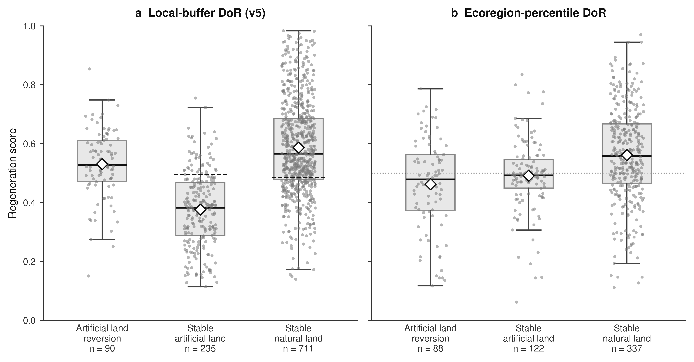
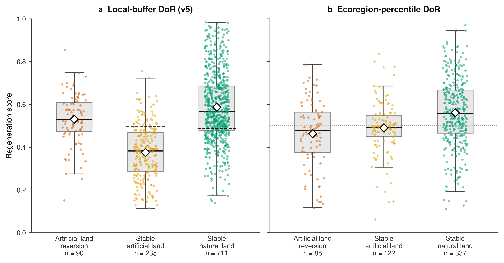

# Methods update — v26062026 (v5 + ecoregion analysis)

> **Review draft.** This file contains only the **new and changed** sections for
> the move from v4 to v5, plus the new ecoregion-level analysis. When approved,
> these blocks replace / extend the corresponding parts of `paper_methods.md`.
> Headline study scope is unchanged: 90 built-loss abandonment test sites and
> 1,471 stable-site controls; cropland classes remain dropped from the DoR
> interpretation (commit 93f16df).
>
> **Terminology:** the metric is the **Degree of Regeneration (DoR)**;
> the positive outcome category is **"regenerating"**; figure axes read
> **"Regeneration score"**. The abbreviation `DoR` and the data-column name
> `dor_knn` are retained for continuity.

---

## A. What changed from v4 to v5

The v4 → v5 change is **not** a re-derivation of the DoR score. The scoring
function (5-NN cosine `d_non / (d_nat + d_non)`, 2,000-bootstrap CIs, empirically
fitted per-class thresholds) and the stable-control calibration are carried over
unchanged. v5 contributes two things:

1. **A principled reference-buffer geometry.** v4 sampled references from
   *adaptive expanding* buffers (1, 1.5, 2, 3, 5, 8 km, growing until the count
  target was met). v5 replaces this with an **annulus-based operating design**
  — an inner exclusion radius and an outer ceiling, with limited expansion when
  count targets are unmet — chosen by an explicit multi-axis
  buffer-desirability analysis (Section B).
2. **An ecoregion-level reference layer and scoring** (Sections C–D), which
   compares each test site to its whole RESOLVE ecoregion rather than only to a
   local distance buffer.

**Updated outcomes under the v5 buffer (all non-crop classes).** Every non-crop
class — the built-loss abandonment test sites and both stable controls — was
re-scored against the v5 operational annulus reference pools (k = 5, per-class
thresholds, 2,000 bootstrap resamples). Cropland classes remain dropped from the DoR
interpretation. Results are summarised in Table V1 and Figure V1.

**Table V1. v5 Degree-of-Regeneration outcomes by class (local-buffer DoR).**

| Class | n | Regenerating | Indistinguishable | Degraded | No data | Median DoR |
|---|---:|---:|---:|---:|---:|---:|
| Built-loss (test) | 90 | 39 (43.3%) | 33 (36.7%) | 18 (20.0%) | 0 | 0.528 |
| Stable built-up (control) | 235 | 17 (7.2%) | 62 (26.4%) | 156 (66.4%) | 0 | 0.383 |
| Stable natural (control) | 711 | 365 (51.3%) | 253 (35.6%) | 84 (11.8%) | 9 | 0.566 |

Only 7.2% of stable built-up controls are classified as regenerating, confirming
that the v5 buffer does not systematically misclassify persistent built-up land
as regenerating. Stable natural controls score highest, built-loss test sites sit
near the boundary (median DoR ≈ 0.53, consistent with land that has lost its
built cover and is partially regenerating), and stable built-up controls score
lowest. The site-level scores, coordinates, and ecoregion percentiles are
exported as `v5/data/test_site_dor_v5_built_loss.shp` (Section E).

> *(Note: stable built-up here corresponds to the screenshot's "Stable
> artificial land" and built-loss to "Artificial land reversion".)*

**Figure V1. Regeneration score by class — local-buffer DoR vs ecoregion percentile.**
Two-panel vertical box-and-strip comparison on a shared score axis (greyscale and
colour versions): **a,** v5 local-buffer DoR (`dor_knn`), with the per-class
fitted threshold marked (dashed); **b,** ecoregion-percentile DoR (`pct_dor`),
with the percentile midpoint (0.5) marked (dotted). White diamonds are class
means. Both panels show the same three non-crop classes; panel **b** uses the
subset of sites whose ecoregion has an FSCS reference file (n = 88 / 122 / 337).
The ecoregion-percentile medians are compressed near 0.5 and separate the classes
less strongly than the local-buffer DoR.

---

## B. Reference buffer geometry (replaces the "Buffer and Sample-Size Rationale" buffer text)

> **Replaces** the paragraph in the main text beginning *"Reference pixels were
> sampled from adaptive 1-8 km concentric buffers…"* and the matching
> Supplementary "Buffer and Sample-Size Rationale" buffer paragraph.

References were drawn from a concentric **annulus** around each test site,
defined by an inner exclusion radius and an outer ceiling (`inner ≤ distance <
outer`), rather than from v4's expanding series of nested buffers. The inner
exclusion removes the near-field pixels most likely to be contaminated by the
test site itself, and the outer ceiling keeps references within a comparable
landscape context while admitting enough spatially independent pixels to support
a stable confidence interval. The diagnostic optimum was 3–8 km, while the
production extraction used the operational 4–5 km annulus, expanding to 8 km
where needed to meet reference-count targets.

The buffer geometry was selected by a buffer-desirability analysis over a grid of
inner (0–4 km) × outer (1–8 km) candidate annuli, scored on five axes evaluated
per land-cover class (including the built-loss and stable classes):

- **Contamination** — fraction of the close-and-similar bad-reference mass
  removed by the inner exclusion (built-loss bad refs with cosine < 0.05;
  saturates by inner ≈ 300–500 m).
- **Separability** — leave-one-out reference classification of near-natural vs
  non-natural pixels, summarised by MCC and F1 at the MCC-optimal threshold.
- **Spatial independence** — mean within-pool cosine similarity of retained
  reference pairs (lower = more independent); driven mainly by the *outer*
  ceiling, plateauing by ≈ 5 km.
- **Confidence** — bootstrap CI width.
- **Retention** — number of references retained (hard floor at 85% of the best
  paired count).

To avoid the inflation produced by min–max normalisation (which pins every
axis's best cell to 1.0), the axes were summarised by **two complementary
scores**, both reported: a **quality score** `D_quality` on native-[0,1] metrics
(answers "how good, really?", capped near 0.67 because spatial independence is
genuinely weak — AlphaEarth references stay ≈ 78% similar regardless of buffer),
and a **ranking score** `Z_composite` of per-axis z-scores (answers "which buffer
is best?"). The two rankings agree closely (Spearman ≈ 0.94), so the chosen
buffer is robust to the scoring choice.

The desirability optimum is **inner = 3 km, outer = 8 km** (top `Z_composite`;
`D_quality` = 0.67), sitting on a broad plateau (≈ 20 candidate annuli within
0.3 SD of the top). At this geometry, built-loss reference separability is high
(MCC = 0.916, F1 = 0.961, AUC = 0.992) — higher than the stable sanity classes —
confirming the near-natural and built-up reference pools are cleanly separable in
embedding space. The DoR point estimate is nearly invariant to the outer ceiling
(drift < 0.02 over 3–8 km, because the 5-NN score uses only the nearest
references); the wider outer ceiling primarily tightens the confidence interval
and lowers reference autocorrelation.

> **Operational note for transparency.** The candidate (built-loss) reference
> pool that was extracted and used for the v5 site scores realised an
> **inner exclusion of 4 km with an outer ceiling of 5 km, expanding to 8 km**
> for the 39 parents that did not meet the per-pool count target within 5 km.
> This sits on the same desirability plateau as the 3 km/8 km optimum (built-loss
> MCC = 0.906–0.916 across inner 3–4 km), so the operating geometry is consistent
> with the recommended design. We therefore report both the diagnostic optimum
> and the realised operating geometry, and use the latter for the v5 site scores.

A diagnostic note on the human-modification gradient: DoR is **not** decorrelated
from the global Human Modification index (GHM). A regenerating site embedded in a
more modified landscape genuinely is less regenerated, so |ρ(DoR, GHM)| is reported
as a diagnostic rather than minimised. Built-loss DoR is only weakly correlated
with GHM (ρ ≈ +0.20, ns), i.e. the built-loss scores are not GHM-confounded.

---

## C. Ecoregion-level reference sampling (new Supplementary Methods subsection)

> **New subsection** for Supplementary Methods, after "Reference Pools".

As a complement to the local distance-buffer references, we built an
**ecoregion-level reference layer**. The motivation is ecological: pixels within
the same RESOLVE 2017 ecoregion share a biome-level habitat context (climate
regime, vegetation structure, biogeographic history) that a fixed distance buffer
cannot guarantee — an 8 km buffer can straddle an ecoregion boundary and admit
pixels whose embeddings are superficially similar but ecologically irrelevant as
regeneration references. Restricting the reference population to the same ecoregion
removes that source of misattribution without tightening the spatial radius. This
layer is a data-preparation stage only; it does not change the DoR scoring
function.

**Inputs.** AlphaEarth Annual Composite (year 2022, 64 bands, 10 m; the most
recent full-year composite available when the layer was built); ESA WorldCover v2
for the natural / non-natural label; the HABLOSS multi-year loss-trend layers
(the same exclusion mask as the v5 candidate sampler); and RESOLVE 2017
Ecoregions for the sampling polygon and `eco_id`.

**Ecoregion selection.** Each abandonment parent centroid is spatially joined to
the RESOLVE polygon it falls in; the union of matched `ECO_ID` values, restricted
to ecoregions containing at least one built-loss parent, gives the working set of
ecoregions.

**Natural / non-natural label.** A sampled pixel is labelled natural when its
WorldCover class is not cropland, built-up, or water, **and** it does not fall in
the HABLOSS loss-trend exclusion. This two-layer definition matches the good /
bad pool logic of the buffer sampler exactly, so the natural/non-natural
definition is identical across both reference pipelines.

**Feature Space Coverage Sampling (FSCS).** Each ecoregion's bounding box is
divided into a 10 km covering grid in the ecoregion's native CRS. Within each
grid cell, FSCS clusters the pixels in the first 10 AlphaEarth bands
(`n_clusters` adaptive to cell density, up to 100) and selects, per cluster, the
pixel nearest the cluster centroid. This spreads the reference sample evenly
across the ecoregion's feature space rather than its geographic space. Each
sampled point carries its 64-band embedding, the natural label, coordinates,
`eco_id`, and grid-cell index. Grid cells with < 10 valid pixels inside the
polygon are skipped.

The sampler was run across the ecoregions containing built-loss parents
(`sample_reference_states.py --all --skip_crop`); the per-ecoregion reference
clouds are written as `v1-ecoregion/data/ref_samples_eco{eco_id}.parquet`.
*(Two production caveats: the FSCS layer uses the 2022 AlphaEarth vintage while
site features use 2024 — the inter-year shift is small but non-zero; and a small
number of large ecoregions were re-filled after a checkpoint/CIFS write fix —
see the v1-ecoregion handoff notes.)*

---

## D. Ecoregion-level percentile scoring and results (new Results subsection)

> **New subsection** for Results / Supplementary.

For each test site we computed its mean cosine similarity (2024 embedding) to its
ecoregion's natural-reference cloud and to its built-reference cloud, then
expressed each as a **percentile rank** within a null distribution built from the
ecoregion's own references (the mean reference-to-all-references similarity,
mirroring the bioregion `C_eco` baseline). High `pct_vs_good` means the site is
as similar to the natural references as the most reference-like pixels in its
ecoregion; high `pct_vs_bad` means it resembles the built references. A single
directional ecoregion DoR percentile combines them:

`pct_dor = (pct_vs_good + (100 − pct_vs_bad)) / 2`

so high values indicate a site that is natural-like and not built-like relative
to its ecoregion.

Of the 90 built-loss test sites, 88 fell in an ecoregion with an FSCS reference
file and were scored (the other two ecoregions lacked a reference file). Median
ecoregion percentiles by class (scored sites only) are:

| Class | n | `pct_vs_good` | `pct_vs_bad` | `pct_dor` |
|---|---:|---:|---:|---:|
| Built-loss (test) | 88 | 23.3 | 33.4 | 48.0 |
| Stable natural (control) | 337 | 31.2 | 16.6 | 55.9 |
| Stable built-up (control) | 122 | 11.3 | 12.9 | 49.3 |

The ecoregion-percentile result is consistent with the broad control contrast
but weaker than the buffer-based DoR: stable natural controls score highest
(most natural-like, least built-like), while built-loss and stable built-up sites
are tightly grouped near the percentile midpoint (median `pct_dor` = 48.0 and
49.3, respectively). Built-loss sites have lost their built cover and are partly
natural-like relative to their ecoregion, but this whole-ecoregion rank does not
separate them cleanly from persistent built-up controls. The ecoregion
percentile is therefore reported as a complementary, biome-anchored diagnostic
alongside the local-buffer DoR, not as a replacement for it.

---

## E. Output: v5 built-loss point shapefile (new data-availability / supplementary note)

The 90 built-loss test-site DoR results are released as a point shapefile,
`v5/data/test_site_dor_v5_built_loss.shp` (Point, EPSG:4326), with a companion
field-level metadata file (`…metadata.txt`). Features are sorted **descending by
`dor_knn`** (rank 1 = most regenerated) and carry: the per-site DoR (`dor_knn`) and
its 95% bootstrap CI, the operating threshold and category (regenerating / degraded
/ indistinguishable), the secondary median-based DoR, the good/bad reference
counts, the RESOLVE `eco_id`, and the ecoregion percentiles (`pct_vs_good`,
`pct_vs_bad`, `pct_dor`). The schema follows the prior v4 export
(`export_v4_shp.py`): DBF-safe field names (≤ 10 characters) and an explicit
`rank` column.

---

## F. Citations to add

- **RESOLVE 2017 Ecoregions** — Dinerstein, E., Olson, D., Joshi, A., Vynne, C.,
  Burgess, N.D., Wikramanayake, E., Hahn, N., Palminteri, S., Hedao, P., Noss,
  R., Hansen, M. et al., 2017. An ecoregion-based approach to protecting half the
  terrestrial realm. *BioScience*, 67(6), pp.534–545.
  *(GEE asset `RESOLVE/ECOREGIONS/2017`.)*
- **Feature Space Coverage Sampling** — cite the FSCS / conditioned Latin
  hypercube lineage used for the ecoregion sampler *(confirm preferred reference:
  Brus, 2019, "Sampling for digital soil mapping", or the cLHS Minasny &
  McBratney 2006 paper)*.

*(The WorldCereal citation is no longer needed for the DoR text since cropland is
dropped, but it remains in use for the stable-site classification vote in
Supplementary Table S1.)*
